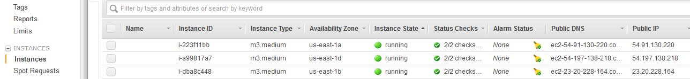
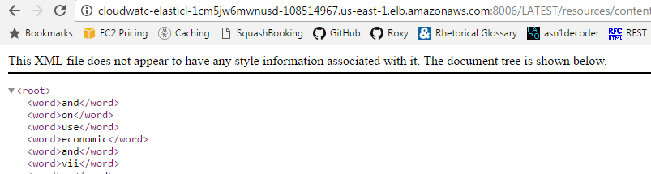

# Monitoring your MarkLogic Cluster using CloudWatch

You’re running or thinking of running your MarkLogic cluster on AWS but you will want to know if anything out of the ordinary happens. [AWS CloudWatch](https://aws.amazon.com/cloudwatch/)  can help. It allows you to collect system metrics and, based on those metrics, alert you if the unexpected happens.

MarkLogic Server helps you via it’s [Monitoring API](http://docs.marklogic.com/guide/monitoring/monitoringAPI), which gives you real time data on every aspect of its internal operation.

Finally you need something to tie things together. That’s where https://github.com/ken-tune/cloud-watch-for-marklogic comes in. A few straightforward steps will allow you to set up CloudWatch monitoring and alarms for your AWS cloud based MarkLogic app. 

This page goes through that process using a test application bundled alongside [cloud-watch-for-marklogic](https://github.com/ken-tune/cloud-watch-for-marklogic). We also use JMeter and a provided config file to simulate activity so’s we can get comfortable with the end result.

## AWS Cluster Setup using Cloud Formation Templates

If you haven’t got a cluster yet, it’s a snap to set one up using MarkLogic’s Cloud Formation templates (CFT). You can watch this [12 minute MarkLogic video](https://www.youtube.com/watch?v=nDPipDR7GSs) or you can follow the [MarkLogic documentation](http://docs.marklogic.com/guide/ec2/CloudFormation#id_25464). You’ll end up with something that looks like what’s below. Couple of useful tips – firstly do set up and use an [SNS topic](https://aws.amazon.com/sns/) when creating your stack – it will help in case there are any difficulties. Secondly, if just experimenting, m3.medium, at (currently) $0.07 per hour is the lowest cost option and us-east1a/b/d are good choices of [AZ](http://docs.aws.amazon.com/AmazonRDS/latest/UserGuide/Concepts.RegionsAndAvailabilityZones.html) – m3.medium is not available in us-east-1c. I used this [Cloud Formation Template](https://s3.amazonaws.com/marklogic-releases/8.0-6/ThreePlusCluster-BYOL.template).

When you’re done, your running instances page should look something like

and your load balancer’s health check page should look like

-	note the ‘InService’ status.

Worth making a note of your elastic load balancer (ELB) name – here’s where you find it in the console

so mine is called cloudwatc-ElasticL-1CM5JW6MWNUSD-108514967.us-east-1.elb.amazonaws.com

## Setting up the demo application

In this section we set up the test application. This configures a REST server and a custom endpoint allowing randomized retrieval and storage of documents, resulting in a pseudo-realistic workload. You can find full details in the project's [README.md](https://github.com/ken-tune/cloud-watch-for-marklogic/blob/master/README.md#cloudwatch-demo)

Log in to one of your hosts via ssh (see [Getting Started](http://docs.marklogic.com/guide/ec2/GettingStarted#id_24571) for key details), so for me

*ssh ec2-user@ec2-54-91-130-220.compute-1.amazonaws.com*

Once you’re there …

Install git - *sudo yum -y install git*

Download ‘cloudwatch-for-marklogic’ - *git clone git@github.com:ken-tune/cloud-watch-for-marklogic.git*

*cd cloudwatch-for-marklogic/test-application*

Edit *deploy/local.properties* (screenshot below) - **user** and **password** should be the same as the values used for AdminUser/AdminPass in the CFT. Use something that can't be easily guessed.

Set up your application : *./doAll.sh*
We’re on a three node cluster, so we can set up replica forests for failover

*./ml local create_application_replica_forests* -	the existence of these gets monitored so let’s have those as well.

## Testing the application

Type http://YOUR_ELB_NAME:8006/LATEST/resources/content into your brower and use credentials cloudwatch-demo-user/cloudwatch-demo-user. Your browser will either save a file or open up a file that looks something like

There’s a one in 10 chance of the latter. If the former, the resulting text file will look something like

--	basically a multipart/mixed format.

## Setting up data collection

Make sure you’re in the *cloud-watch-for-marklogic* directory. Run *./cronCloudWatchUpdate.sh*. You’ll see

This sets up a cron job that runs every minute that collects MarkLogic metrics. It’s based on [metrics.xml](https://github.com/ken-tune/cloud-watch-for-marklogic/blob/master/metrics.xml). A typical entry is

Which uses the http://YOUR_HOST:8002/manage/v2/servers/cloudwatch-demo-rest?view=status&group-id=Default (MarkLogic REST API) output and finds the value of **total-requests**

If you take a look at the crontab

you’ll see it calls *python update-cloudwatch-metrics.py –storeMetrics*

We can take a look at what it’s does by calling directly (output truncated )

--	useful if something is not quite right. Note that you can call with the --debug flag if you want output but no actual action.
If you can find your way to the CloudWatch console you can take a look at what you got so far. Let’s pick on the db-size metric as we haven’t yet simulated any activity

CloudWatch is telling us our db size is 31Mb.

## Setting up Alarms

AWS will send alerts if a given metric exceeds ( or undershoots ) a given value. To set up, first edit *config.py* and change the entry for **EMAIL_FOR_SNS** to the address you’d like alerts sent to.

Now run

*python update-cloudwatch-metrics.py --setAlarm*

and you’ll see something like

You’ll also get an email similar to the below – which you need to confirm receipt of.

We can have a look at the alarms in the AWS console – I have 31 alarms set up.

## Simulating activity

Install [JMeter](http://jmeter.apache.org/) and open *simulation-for-cloudwatch.jmx* which can be found in the jmeter directory of the project. This will simulate user activity using the test application we set up. Change the **thread_count** field to represent your user count ( I use 40 ) and replace **localhost** as the host name with your **ELB name**

Click the green ‘Start’ button, and take a look at ‘View results in table’

This volume of requests should be enough to trigger the ‘total-requests’ alert and indeed it does – I get this email

and I can take a look at this in the AWS Console

Now I've got some simulated data coming in I can use CloudWatch to take a look at what's happening on my cluster. Here's some data on usage of the expanded tree cache.

## Wrap Up

Hopefully this *HOWTO* helps you to see how easy it is to set this up. Have a look at [metrics.xml](https://github.com/ken-tune/cloud-watch-for-marklogic/blob/master/metrics.xml) to get a feel for what’s being monitored. Your needs may vary so if using for a production system, consider carefully the values used for the various thresholds. The project [README.md](https://github.com/ken-tune/cloud-watch-for-marklogic/blob/master/README.md) will talk you through how to tear down alarms – do this before shutting down if you’re just testing. Similar instructions are provided for tearing down the test project, and note, again, for a production system, you will need to change the handful of values in *config.py* as, as shipped, they relate to the test application.
